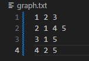

This is my A*, Project 1 implementation for the Advanced AI Class I am taking at the University of North Florida while undertaking my Masters in CS.

This Python project does the following
  - Reads the x-y coordinates of the nodes from a text file called "coords.txt".
  - Reads an adjacency list of an undirected graph from a text file called "graph.txt" in the project directory. This is used to create the edges.
    -- Note: If an edge includes a point in graph.txt, coordinates for that point must exist in coords.txt!
  - Uses the iGraph library for Python to create the graph
  - Node IDs are integers
  - Edge weights are calculated based on the nodes' coordinates or the Euclidean distance between two nodes
  - If there is an edge between nodes a and b, an edge is not added for b and a.
  - The program also displays the graph using matplotlib
  - The program implements the A* algorithm, allowing the user to find the shortest path between two nodes on the graph. Additionally, the user can block nodes to represent real-world obstacles.

Set up
  - Ensure Python 3.x is installed on your system. You can download it from python.org.
  - Clone this repository to your local machine or download the project files.
  - Navigate to the project directory and create a virtual environment:
    - `python -m venv venv`
  - Activate the virtual environment:
    - On Windows Command Prompt:
      - `.\venv\Scripts\activate`
    - On Windows PowerShell
      - `.\venv\Scripts\Activate.ps1`
        - Note: If you run into issues on PowerShell, you may need to run the following command as an administrator to temporarily change your execution policy.
        - `Set-ExecutionPolicy -ExecutionPolicy RemoteSigned -Scope Process`
        - This will allow you to run scripts for the current PowerShell session only, without permanently changing your execution policy.
        - If you prefer not to do this, simply use the Windows Command Prompt instead.
    - On macOS and Linux:
      - `source venv/bin/activate`
  - Install the required dependencies:
      - `pip install -r requirements.txt`

Preparing Your Data
- Prepare two text files in the project directory: coords.txt for node coordinates and graph.txt, which is formatted as an adjacency list.
- The coords.txt file should list each node's ID followed by its x and y coordinates, separated by spaces. Start counting nodes from 1.
- The graph.txt file should list each node's ID followed by the IDs of nodes it is connected to, representing the graph's edges.
- Note: Vertex IDs must be integers, or you will return into issues. X and Y coordinates may be floats or integers.

Your graph and coords text files should look like the following: notice we start counting nodes from 1. Note: Do not count from 0 in your input.
  

  

Running the Program
- With your virtual environment activated and the required text files prepared, run the program using:
  - `python main.py`
- See below image for an example of how to use the program
  - 

Viewing the Results
- After running the program, check the `graph_visualizations` folder in the project directory for the generated visualization images. These images will show the original graph and the calculated shortest path.
- The images are saved as `original_graph.png` for the initial graph visualization, `my_solution.png` for my A* implementation, and `official_igraph_solution.png` for the path returned back the iGraph Dijkstra implementation. 
- The visited nodes are highlighted in green in the solutions, while the blocked nodes are highlighted in red.
- The exact path order can seen in the lists in the console. 
  - Note: it is possible my path, and the iGraph solution path may be different, however the total cost should be the same.

Troubleshooting
- Ensure that all node IDs in graph.txt have corresponding coordinates in coords.txt.
- If the program cannot find a path, verify that the starting and goal nodes are connected and that not too many nodes are blocked.
- Ensure vertex indexes start counting from 1 in your input files.
- When choosing which nodes to start from, end on, or block, ensure you enter their IDs as displayed in `original_graph.png`.