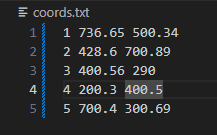

Project 1 for Advanded AI Class

This Python project does the following
  - Reads the x-y coordinates of the nodes from a text file called "coords.txt"
  - Reads an adjacency list of an undirected graph from a text file called "graph.txt" in the project directory. This is used to create the edges.
    -- Note : If an edge includes a point in graph.txt, coords for that point must exist in coords.txt!
  - Uses the iGraph library for Python to create the graph
  - Node IDs are integers
  - Edge weights are calculated based on the nodes' coordinates, or the Euclidean distance between two nodes
  - If there is an edge between nodes a and b, an edge is not added for b and a.
  - The program also displays the graph
  - Additionally, the program implements the A* algorithm, allowing the user to find the shortest path between two nodes on the graph. Additionally the user can block nodes to represent real world obstacles.

Requirements
  - To install requirements, in your Python Virtual Environment, run:
    - `pip install -r requirements.txt`

Your graph and coords text files should look something like the following: notice we start counting nodes from 1.
  

  

